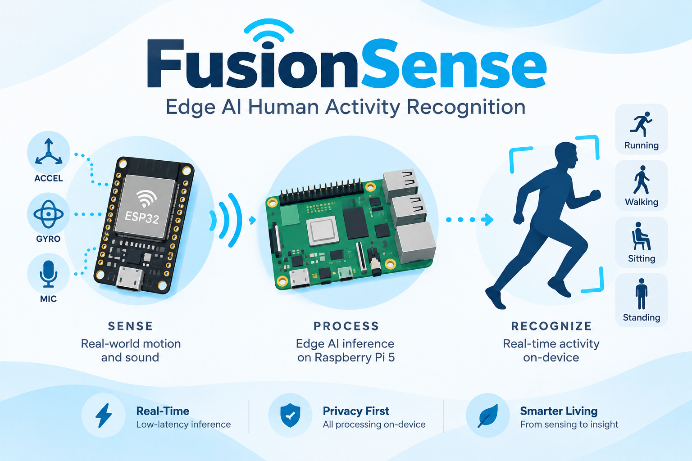

# FusionSense



Lightweight, **sensor-health-aware** multimodal Human Activity Recognition (HAR)
for edge devices. The practical V1 fuses **third-person MediaPipe pose + a
waist-worn IMU** with merged-token cross-modal attention. It recognizes seven
C-MHAD posture transitions, including stand-to-fall. mmWave radar is a future
third modality, not a V1 dependency.

> **Framework vs. application:** FusionSense is a *general HAR framework*; fall
> detection is the *demo*. Write it that way — it's reusable and stronger.

For the current v1 plan, see **[docs/CURRENT_PROJECT_PLAN.md](docs/CURRENT_PROJECT_PLAN.md)**.

## Two ways to run: simulator (plumbing) vs. real data (results)

There is **one data contract** — `FusionWindow` (`fusionsense/contract.py`) — and
two sources that both emit it:

1. **Simulator** — fake data for **testing the pipeline only**. Great for
   validating shapes, masking, and the robustness logic with zero hardware.
   **Not** for real accuracy claims (its "video" is random numbers).
2. **Real datasets** — the actual training path. Each encoder is pretrained on a
   real single-modality benchmark, then the cross-modal attention is trained on
   paired data. See **[docs/DATASETS.md](docs/DATASETS.md)**.

## Training is two stages (modular pretraining)

```
Stage 1  Train both V1 encoders on C-MHAD training subjects
              enc_imu   <- waist IMU windows
              enc_vis   <- MediaPipe pose sequences

Stage 2  Train the CROSS-MODAL ATTENTION on PAIRED data (sensors time-aligned)
              C-MHAD (camera + waist IMU)          (scripts/train_cmhad.py)
```

Why paired data for Stage 2: attention learns *relationships between modalities
at the same instant*. Separate datasets never show both sensors describing one
moment, so the cross-modal layer needs aligned camera and IMU data.

## V1 hardware and runtime

V1 uses a wearable ESP32 to read the waist-mounted MPU-6050 and transmit
timestamped samples. A fixed external laptop/USB camera observes the complete
person. MediaPipe Pose extracts landmarks, and the laptop synchronizes both streams
into two-second `FusionWindow`s, runs the model, and drives the dashboard and
fall alerts. Radar is zero-filled with `radar_valid=False`; no Raspberry Pi is
involved. See
**[docs/CURRENT_PROJECT_PLAN.md](docs/CURRENT_PROJECT_PLAN.md)**.

### Live IMU status

The wearable ESP32 is currently detected on **COM17** through a CP210x USB-UART
bridge. Its connected IMU reports `WHO_AM_I=0x70` (MPU-6500-compatible), and the
updated hardware test sketch produces scaled seven-field rows at the required
50 Hz (`20 ms` timestamp increments). The timestamped persistent-serial
recorder is now hardware-verified: a 59.98-second stationary run captured 3,000
samples at exactly 50.0 Hz, with zero invalid rows, missed slots, sequence gaps,
or non-monotonic timestamps. Mean acceleration magnitude was `0.99962 g` and
mean gyroscope magnitude was `0.12035 dps`, so hardware Step 1 passes.

A later live run showed a transient burst of 190 I2C read errors even though the
50 Hz scheduler itself missed no slots. The firmware now uses a conservative
100 kHz I2C clock and reports per-window as well as cumulative errors. Stable,
soldered or firmly seated power/SDA/SCL connections are required; recovery after
a burst does not count as a passing stability test.

The timestamped ESP32-CAM Step 2 firmware and laptop multipart reader are
implemented and hardware-verified. A 30.255-second live run delivered 283 QVGA
JPEG frames at 9.32 device FPS, with zero sequence drops and zero capture
errors. See
[`hardware/esp32_cam/README.md`](hardware/esp32_cam/README.md); set Wi-Fi values
only in its ignored `fusionsense_camera/secrets.h` file.

The camera-only recorder keeps that stream on one persistent Wi-Fi TCP
connection and stores original JPEGs plus capture/receive metadata:

```powershell
.\.venv\Scripts\python.exe .\scripts\record_esp32_camera.py --host <esp32-ip> --duration 60
```

The camera recorder is hardware-verified: 581 original QVGA JPEGs over 60.078
device seconds at 9.65 FPS, zero drops, and zero capture errors.

The IMU persistent USB-serial contract and laptop recorder are implemented and
hardware-verified:

```powershell
.\.venv\Scripts\python.exe .\scripts\record_imu_serial.py --port <imu-com-port> --duration 60 --stationary
```

The verified session is under `data/recordings/imu_20260817T174209Z/`; its
`session.json` records the full validation report. Both standalone transports
are therefore ready for concurrent collection and laptop clock mapping.

### Step 4: synchronized bimodal recording

The combined laptop collector is implemented at
`scripts/record_fusion_session.py`. It reads the IMU and camera independently,
uses request/response IMU clock probes plus fixed-header camera serial arrival
observations, fits
`host_ns = scale * device_us * 1000 + offset_ns` for each ESP32, and writes both
raw device timestamps and mapped laptop capture timestamps. It never aligns
samples by arrival order.

The hardware-verified path uses the timestamped binary camera firmware over USB
serial, avoiding Wi-Fi entirely. After closing both Arduino Serial Monitors:

```powershell
.\.venv\Scripts\python.exe .\scripts\record_fusion_session.py --imu-port COM17 --camera-port COM14 --duration 60 --motion-check
```

After about ten seconds, perform three distinct, sharp side-to-side movements
while the IMU is clearly visible to the camera. The collector now warms the
camera before flushing the IMU to a complete serial-line boundary, reuses one
persistent camera control connection, saves malformed input in
`malformed_imu.csv`, rejects multi-second camera stalls/excessive latency, and
uses shared-motion cross-correlation for the 50 ms alignment gate. Nearest-IMU
sample distance is diagnostic only. Because camera USB timing is one-way, the
lowest-delay header observations determine scale/drift and the shared movement
supplies the absolute offset; the raw and applied offset are retained in the
report.

Step 4 is hardware-verified by
`data/recordings/fusion_usb_step4_20260819/`. It contains 3,000 IMU samples at
50.0 Hz and 601 QVGA JPEG frames at 10.005 FPS, with zero malformed rows,
capture errors, sequence gaps, or dropped frames. IMU/camera clock-fit p95
residuals are 7.61/14.89 ms, shared-motion correlation is 0.597, calibrated
remaining lag is 0 ms, and the authoritative top-level result is `PASS`.

### Step 5: model-ready synchronized windows

Build the deterministic two-second/one-second-stride window artifact from the
passing recording:

```powershell
.\.venv\Scripts\python.exe .\scripts\build_recorded_windows.py `
  --session-dir .\data\recordings\fusion_usb_step4_20260819
```

The verified Step 5 output contains 58 windows with IMU `100 x 6`, camera pose
`20 x 99`, and masked radar `40 x 8`. All 58 windows have valid IMU and at
least one usable modality; 24 also pass the full-body pose gate. IMU and camera
sampling coverage are 100%, maximum resampling skew is 2.751/53.993 ms, and
the converted acceleration median is 9.797 m/s². See `step5_validation.json`
and `step5_windows.npz` inside the accepted session directory.

### Laptop inference and mentor dashboard

The laptop inference path is implemented. It converts ESP32 acceleration from
`g` to the C-MHAD/model contract in `m/s²` using
`m/s² = g × 9.80665`; gyroscope `deg/s` values are unchanged. Converted values
must pass a physical-scale check before timestamp resampling and checkpoint
normalization.

Generate the mentor demonstration from real held-out C-MHAD windows, then serve
the local HTML dashboard:

```powershell
.\.runtime\python311\python.exe .\scripts\run_fall_pipeline.py --mode mentor
.\.runtime\python311\python.exe .\scripts\serve_dashboard.py --open
```

The generated `dashboard/mentor_demo.json` reports 106 Subject3 windows, 84.91%
accuracy, 0.8221 macro-F1, 100% fall recall, and a selected correct fall example
at 99.4536% probability under the Step 8-selected checkpoint. The page labels
every event as a dataset replay—not a live ESP32 detection.

Replay a real combined hardware recording through the same unit conversion,
two-second window assembler, MediaPipe pose cache, model, and alert policy:

```powershell
.\.runtime\python311\python.exe .\scripts\run_fall_pipeline.py --mode recorded `
  --session-dir .\data\recordings\fusion_usb_step4_20260819
.\.runtime\python311\python.exe .\scripts\serve_dashboard.py --data session_output.json --open
```

Step 5 validated the 58 model-ready windows independently of PyTorch; the Step
6 result from this checkpoint command is recorded below.

The current replay uses `checkpoints/cmhad_step7_bimodal_dropout_fixed`. It
withholds 34 windows without valid full-body pose and evaluates only the 24
windows containing both valid inputs. Median learned trust is 85.31% IMU and
14.69% camera, with radar fixed to false/zero. The checkpoint predicts
`lie_to_stand` for all 24 windows, raises no fall alert, and reaches maximum fall
probability 0.001097. This unlabelled recording is a pipeline test, not an
accuracy measurement. The event artifact is `dashboard/session_output.json`.

Close Arduino Serial Monitor, then run the validator from this repository:

```powershell
cd "C:\Users\SHIRDITHAN\OneDrive\Desktop\fusionsense\Fusion-Sense-fork"
.\.venv\Scripts\python.exe .\scripts\validate_imu_stream.py --port COM17 --duration 300
```

## Quick start

```bash
pip install -r requirements.txt          # CUDA torch build for your 4060

# See / sanity-check the data (no torch)
python scripts/viz_windows.py
python tests/test_pipeline.py
python tests/test_camera_stream.py
python -m unittest tests.test_validate_imu_stream -v

# Download the official local MediaPipe model once
python scripts/download_pose_model.py

# After flashing CameraWebServer and finding the ESP32-CAM IP
python scripts/test_esp32_camera.py --host 192.168.1.42

# Smoke-test the training pipeline on the simulator (needs torch):
python scripts/pretrain_imu.py --sim
python scripts/train_fusion.py --sim

# Real C-MHAD V1
python scripts/check_cmhad.py --raw-root data/raw/cmhad --expected-subjects 4
python scripts/prepare_cmhad.py --raw-root data/raw/cmhad
python scripts/check_cmhad.py --expected-subjects 4 --require-cache
python scripts/train_cmhad.py --stage all --expected-subjects 4 \
  --output-dir checkpoints/cmhad_pilot4
```

### Step 7: explicit bimodal baselines and masked fusion

The auditable Step 7 run uses the same paired windows and held-out Subject3
split for all models:

```powershell
.\.runtime\python311\python.exe .\scripts\train_bimodal_step7.py `
  --output-dir .\checkpoints\cmhad_step7_bimodal `
  --baseline-epochs 20 --fusion-epochs 20
```

It saves complete IMU-only and vision-only classifiers plus the masked
IMU+camera fusion checkpoint. Radar is invalid for every training/validation
window and has zero fusion trust. Held-out results are:

| Model | Accuracy | Macro-F1 | Fall recall |
|---|---:|---:|---:|
| IMU only | 0.6132 | 0.4356 | 0.0000 |
| Vision only | 0.8774 | 0.8649 | 1.0000 |
| Masked IMU + camera fusion | 0.8396 | 0.8091 | 1.0000 |

Fusion did not outperform vision-only on this four-subject pilot; Step 8 must
report that result and evaluate precision, false alerts/hour, dropout,
synchronization error, and latency before selecting a deployment checkpoint.
See `checkpoints/cmhad_step7_bimodal/step7_metrics.json` and `training.log`.

The post-training audit in `docs/STEP7_ACCURACY_AUDIT.md` found that in-place
modality dropout shared storage with, and progressively erased, source NumPy
windows. The corrected frozen-encoder fusion reaches 0.8491 accuracy / 0.8221
macro-F1; a controlled end-to-end fine-tuning run reaches 0.8679 / 0.8201.
Both classify all 9 held-out falls by argmax with zero fall false positives,
but thresholded alert recall differs in Step 8. This is still a one-subject
pilot and camera-only remains stronger overall. The fix is guarded by
`tests/test_dataset_dropout.py`.

### Step 8: fall-safety and robustness evaluation

The research-pilot Step 8 evaluation is complete. It covers thresholded fall
precision/recall, continuous false alerts/hour, modality dropout,
synchronization perturbations, measured USB timing, preprocessing/model
latency, and unlabelled hardware replay.

At alert threshold 0.60, the corrected frozen-fusion checkpoint detects all
9 labelled falls with no labelled false positives and has zero observed false
alert episodes over 545 genuine negative windows (18.17 minutes). The sample is
too short for a safety claim: the zero-count one-sided 95% upper bound remains
9.89 alerts/hour. Camera dropout also reduces fall alerts to 0/9. The
fine-tuned checkpoint is rejected because it alerts on only 4/9 falls at the
same threshold.

Step 9's prototype checkpoint is therefore
`checkpoints/cmhad_step7_bimodal_dropout_fixed/fusionsense_cmhad.pt`, and live
inference must require both valid IMU and camera pose. See
`docs/STEP8_EVALUATION.md` and
`checkpoints/step8_pilot_evaluation_v3.json` for the complete evidence and
limitations.

### Step 9: live laptop inference and dashboard

Step 9 is complete as a local research prototype. The live runner reads the
timestamped IMU and ESP32-CAM USB streams, builds synchronized two-second
windows every second, and updates the dashboard with alert state, activity
confidence, fall probability, UTC timestamp, inference latency, and sensor
health/trust. Its defaults are currently IMU COM16 and camera COM14; if Windows
reassigns either device, the runner identifies the unique USB VID/PID match.

Run these in two terminals after closing Arduino Serial Monitor:

```powershell
.\.runtime\python311\python.exe -u .\scripts\run_live_fall_pipeline.py
```

```powershell
.\.runtime\python311\python.exe -u .\scripts\serve_dashboard.py `
  --data live_output.json --open
```

Both valid modalities are mandatory. If the IMU fails or a full-body pose is
not visible in at least half the camera frames, the dashboard reports
`DEGRADED` and the model prediction is withheld. See
`docs/STEP9_LIVE_DASHBOARD.md` for the acceptance evidence and operating notes.

### Mobile fall notification

The separate `scripts/send_mobile_notifications.py` consumer sends one urgent
ntfy phone notification per validated live fall episode. It requires a fresh
`FALL_ALERT` with valid IMU and camera input, suppresses repeated fall windows,
and re-arms only after two valid non-fall windows. Configure a long, unguessable
ntfy topic, then run it alongside the live pipeline:

```powershell
$env:FUSIONSENSE_NTFY_TOPIC = "your-long-random-topic"
.\.runtime\python311\python.exe .\scripts\send_mobile_notifications.py --test-notification
.\.runtime\python311\python.exe -u .\scripts\send_mobile_notifications.py
```

See `docs/MOBILE_FALL_NOTIFICATIONS.md` for phone setup, privacy notes, and the
complete notification safety contract.

`scripts/pretrain_radar.py` and the radar encoder remain available for the
later camera + IMU + mmWave extension; they are not required to complete V1.

`scripts/baseline_numpy.py` gives a torch-free baseline + the robustness figure
(useful for reviews before the GPU model is trained).

## The "unique angle"

Not the attention (that's everywhere). The differentiator is **sensor-health
conditioning**: each sensor reports its own reliability — radar gate **energy**,
image **quality**, IMU **clipping**. These scalars ride in every `FusionWindow`
and bias the fusion's trust weights, so the model leans on *physically healthy*
sensors. Trust weights are exported as an interpretable output. Toggle with
`CFG.use_health_conditioning` for the ablation.

## The headline experiment

`train_fusion.py` prints a **robustness table** — accuracy when each modality is
dropped at inference ("no vision" = a dark room). Graceful degradation there,
vs. a collapsing naive baseline, is the core result.

## Layout

```
fusionsense/
  config.py            # knobs + dataset dir names
  contract.py          # FusionWindow — the one interface that matters
  data/
    simulator.py       # fake FusionWindows (plumbing/smoke test only)
    windowing.py       # resample/segment real streams -> fixed windows
    imu_loader.py      # SisFall / UCI-HAR      -> IMU windows
    radar_loader.py    # future mmWave extension
    camera_stream.py   # ESP32-CAM URL/local-camera adapter
    imu_units.py       # g -> m/s² conversion + physical-scale validation
    live.py            # rolling live IMU + camera window assembly
    recorded_session.py# timestamped ESP32 files -> synchronized windows
    vision_extractor.py# MediaPipe Tasks -> 99-value pose frames/windows
    cmhad_loader.py    # C-MHAD camera+waist IMU -> FusionWindows
    registry.py        # unified access + optional simulator fallback
    dataset.py         # torch Dataset + modality-dropout augmentation
  models/
    encoders.py        # ModalityEncoder (pretrainable) + EncoderClassifier
    fusion.py          # attention + health conditioning + load_pretrained_encoders
  train/
    pretrain.py        # Stage 1 engine (one encoder)
    loop.py            # Stage 2 fusion training/eval
    metrics.py         # accuracy, fall recall, robustness_report
scripts/
  prepare_cmhad.py                 # aligned pose+IMU cache
  check_cmhad.py                   # raw/cache validation
  train_cmhad.py                   # IMU -> vision -> fusion training
  download_pose_model.py           # install official pose model asset
  test_esp32_camera.py             # live camera/pose verification
  run_fall_pipeline.py             # checkpoint inference + dashboard JSON
  run_live_fall_pipeline.py        # live COM-port fusion + dashboard feed
  serve_dashboard.py               # local HTML dashboard server
  viz_windows.py, make_figures.py, make_diagrams.py, baseline_numpy.py
hardware/
  esp32_firmware/      # wearable ESP32 + MPU-6050 gateway (.ino)
  esp32_cam/           # ESP32-CAM CameraWebServer setup
  wokwi/               # in-browser circuit simulation
docs/
  CURRENT_PROJECT_PLAN.md # authoritative camera+wearable-IMU V1 plan
  DATASETS.md          # downloads + expected layouts (read this before real training)
tests/test_pipeline.py # numpy-only checks
dashboard/             # mentor/live-replay fall alert page
```

## Roadmap

- **V1 now:** waist MPU-6050 → ESP32 plus a fixed third-person camera;
  run MediaPipe Pose and fusion on the laptop, then show transition confidence
  and stand-to-fall alerts.
- **V1 model rule:** keep radar zeroed and masked with `radar_valid=False`.
- **Later extension:** add a fixed mmWave node, enable the existing radar slot,
  and collect a paired tri-modal dataset without replacing the V1 pipeline.
- **Paper extension:** real sensor-degradation study + health-conditioned ablation.
